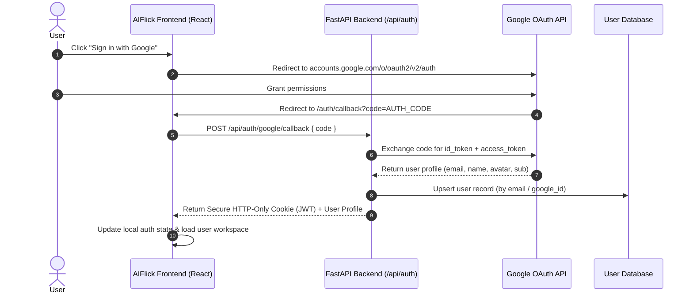
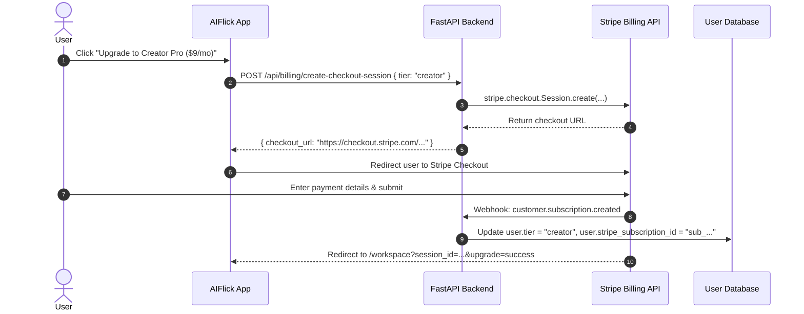

# 🚀 AIFlick — Future Features Architecture & Implementation Roadmap

> **Document Purpose**: This blueprint specifies the complete technical architecture, data schemas, API contracts, and integration workflows for future phases of AIFlick: Google Authentication, Stripe/Billing Subscriptions, Social Media Auto-Publishing, and Multi-Modal Video Generation. **No code implementation has been added to the active codebase per your instruction; this file serves as the definitive engineering roadmap.**

---

## 📑 Table of Contents
1. [Authentication Architecture (Google OAuth & Enterprise Auth)](#1-authentication-architecture)
2. [Monetization & Payment Infrastructure (Stripe / LemonSqueezy)](#2-monetization--payment-infrastructure)
3. [Tier Entitlement & Usage Metering System](#3-tier-entitlement--usage-metering-system)
4. [Direct Social Publishing & Scheduling Engine](#4-direct-social-publishing--scheduling-engine)
5. [Advanced Video & Multi-Modal Studio Engine](#5-advanced-video--multi-modal-studio-engine)
6. [Database Schema Additions (PostgreSQL / SQLite)](#6-database-schema-additions)
7. [Step-by-Step Implementation Action Plan](#7-step-by-step-implementation-action-plan)

---

## 1. Authentication Architecture

### 1.1 Recommended Provider Strategy
- **Option A (Recommended: Supabase Auth / Firebase Auth)**: Handles Google OAuth, Apple ID, Email Magic Links, and session refresh tokens with zero maintenance.
- **Option B (Self-Hosted: FastAPI + Google OAuth2 + JWT)**: Fully custom, zero external vendor lock-in.

### 1.2 Google OAuth 2.0 Flow (Self-Hosted Blueprint)



### 1.3 Backend Endpoints to Create
| Method | Route | Description |
|---|---|---|
| `GET` | `/api/auth/google/url` | Generates OAuth2 consent URL with state & CSRF token |
| `POST` | `/api/auth/google/callback` | Exchanges code for Google tokens, provisions user in DB, issues session JWT |
| `POST` | `/api/auth/logout` | Clears HTTP-only session cookie and invalidates server-side token |
| `GET` | `/api/auth/me` | Returns current user profile, tier, usage limits, and preferences |
| `POST` | `/api/auth/refresh` | Silent refresh of expired access tokens using refresh token |

### 1.4 Frontend Integration Points
- Add Google GSI SDK or `@react-oauth/google` package:
  ```tsx
  import { GoogleLogin } from '@react-oauth/google';
  <GoogleLogin
    onSuccess={async (credentialResponse) => {
      await api.post('/api/auth/google/verify', { token: credentialResponse.credential });
      window.location.reload();
    }}
    onError={() => toast.error('Google Sign-In failed')}
    theme="filled_black"
    shape="pill"
  />
  ```

---

## 2. Monetization & Payment Infrastructure

### 2.1 Provider: Stripe Checkout + Customer Portal
Stripe handles recurring subscriptions, pro-rated upgrades/downgrades, invoice generation, tax calculation, and secure card vaulting.

### 2.2 Subscription Tiers
| Tier ID | Plan Name | Price | Features & Quotas |
|---|---|---|---|
| `free` | Free Explorer | $0/mo | 15 posts/day, Gemini 2.0 Flash, FLUX.1-schnell, Watermark optional |
| `creator` | Creator Pro | $9/mo | 75 posts/day, Gemini 2.5 Flash, FLUX.1-Pro, Carousels up to 10 slides, No watermark |
| `agency` | Agency Studio | $29/mo | Unlimited posts/day, Gemini 2.5 Pro, Google Imagen 3, Custom brand presets, Dedicated pool |

### 2.3 Stripe Webhook Processing Pipeline



### 2.4 Critical Webhook Events to Implement
- `checkout.session.completed`: Initial subscription activation.
- `invoice.payment_succeeded`: Renewal payment success, reset monthly usage counters.
- `invoice.payment_failed`: Grace period notification, email alert.
- `customer.subscription.updated`: Tier upgrade or downgrade applied immediately with prorations.
- `customer.subscription.deleted`: Revert user back to `free` tier.

---

## 3. Tier Entitlement & Usage Metering System

### 3.1 Rate Limiting & Tier Guard Middleware
```python
# Blueprint for FastAPI Dependency:
async def verify_tier_limit(user: User = Depends(get_current_user)):
    daily_usage = await get_daily_post_count(user.id)
    limits = {
        "free": 15,
        "creator": 75,
        "agency": 999999,
    }
    max_allowed = limits.get(user.tier, 15)
    if daily_usage >= max_allowed:
        raise HTTPException(
            status_code=402,
            detail=f"Daily post limit reached ({max_allowed}/day). Upgrade your plan to continue."
        )
```

---

## 4. Direct Social Publishing & Scheduling Engine

### 4.1 Supported APIs & Scopes
1. **Instagram**: Meta Graph API (`instagram_content_publish`, `pages_read_engagement`)
2. **LinkedIn**: LinkedIn Community Management API (`w_member_social`, `r_liteprofile`)
3. **X (Twitter)**: X API v2 (`tweet.write`, `tweet.read`, `users.read`)
4. **YouTube**: YouTube Data API v3 (`youtube.upload`)

### 4.2 Scheduler Architecture
- **Queue System**: Redis + Celery or Temporal.io for durable workflow execution.
- **Auto-Refresh OAuth Tokens**: Background task refreshing expired social access tokens every 24 hours.
- **Calendar UI**: Drag-and-drop calendar view for scheduled posts.

---

## 5. Advanced Video & Multi-Modal Studio Engine

### 5.1 Roadmap Features
- **Video Reel Generation**: Gemini Omni Flash API / Runway / Luma API for turning 4:5 and 9:16 static slides into dynamic moving video shorts.
- **AI Voiceover Narration**: ElevenLabs API text-to-speech synchronized with carousel slide transitions.
- **Dynamic Captions & Subtitles**: Auto-generated animated word-by-word captions (Burned-in or WebVTT).

---

## 6. Database Schema Additions

### SQL Migration Blueprint (PostgreSQL / SQLite)

```sql
-- 1. Users Table
CREATE TABLE users (
    id VARCHAR(64) PRIMARY KEY,
    email VARCHAR(255) UNIQUE NOT NULL,
    full_name VARCHAR(255),
    avatar_url TEXT,
    google_id VARCHAR(128) UNIQUE,
    tier VARCHAR(32) DEFAULT 'free' NOT NULL, -- 'free', 'creator', 'agency'
    stripe_customer_id VARCHAR(128) UNIQUE,
    stripe_subscription_id VARCHAR(128),
    subscription_status VARCHAR(32) DEFAULT 'active',
    created_at TIMESTAMP WITH TIME ZONE DEFAULT CURRENT_TIMESTAMP,
    updated_at TIMESTAMP WITH TIME ZONE DEFAULT CURRENT_TIMESTAMP
);

-- 2. User Preferences & Creator Memory
CREATE TABLE user_preferences (
    user_id VARCHAR(64) PRIMARY KEY REFERENCES users(id) ON DELETE CASCADE,
    brand_name VARCHAR(255),
    brand_handle VARCHAR(128),
    target_audience TEXT,
    tone_of_voice TEXT,
    custom_rules TEXT,
    show_watermark BOOLEAN DEFAULT TRUE,
    preferred_model_tier VARCHAR(32) DEFAULT 'free'
);

-- 3. Daily Usage Tracking Table
CREATE TABLE user_daily_usage (
    id SERIAL PRIMARY KEY,
    user_id VARCHAR(64) REFERENCES users(id) ON DELETE CASCADE,
    usage_date DATE NOT NULL DEFAULT CURRENT_DATE,
    posts_generated INT DEFAULT 0,
    images_generated INT DEFAULT 0,
    UNIQUE(user_id, usage_date)
);

-- 4. Social Accounts Integration
CREATE TABLE user_social_accounts (
    id SERIAL PRIMARY KEY,
    user_id VARCHAR(64) REFERENCES users(id) ON DELETE CASCADE,
    platform VARCHAR(32) NOT NULL, -- 'instagram', 'linkedin', 'x', 'youtube'
    account_id VARCHAR(128) NOT NULL,
    account_name VARCHAR(255),
    access_token TEXT NOT NULL,
    refresh_token TEXT,
    token_expires_at TIMESTAMP WITH TIME ZONE,
    created_at TIMESTAMP WITH TIME ZONE DEFAULT CURRENT_TIMESTAMP
);

-- 5. Scheduled Posts Table
CREATE TABLE scheduled_posts (
    id VARCHAR(64) PRIMARY KEY,
    user_id VARCHAR(64) REFERENCES users(id) ON DELETE CASCADE,
    platform VARCHAR(32) NOT NULL,
    post_json JSONB NOT NULL,
    scheduled_for TIMESTAMP WITH TIME ZONE NOT NULL,
    status VARCHAR(32) DEFAULT 'pending', -- 'pending', 'publishing', 'published', 'failed'
    error_message TEXT,
    published_at TIMESTAMP WITH TIME ZONE
);
```

---

## 7. Step-by-Step Implementation Action Plan

When ready to implement, execute in the following sequential order:

```
[Phase A: Auth]
 ├── 1. Configure Google Cloud Console OAuth 2.0 Credentials (Client ID & Secret)
 ├── 2. Implement backend `/api/auth/google/callback` endpoint in `backend/`
 ├── 3. Create Users database table and token management
 └── 4. Wire `AuthScreen` component in `frontend/src/components/aiflick/auth-screen.tsx`

[Phase B: Billing & Payments]
 ├── 1. Setup Stripe Products & Pricing for Creator Pro ($9) and Agency Studio ($29)
 ├── 2. Implement `/api/billing/create-checkout-session` & Stripe webhook listener
 ├── 3. Replace "Coming Soon" state in `settings-modal.tsx` with live checkout triggers
 └── 4. Add quota enforcement middleware in `api/` endpoints

[Phase C: Publishing & Scheduler]
 ├── 1. Register Meta Developer & LinkedIn Developer Apps
 ├── 2. Implement Social OAuth token storage
 └── 3. Build post scheduler background worker & calendar view
```
